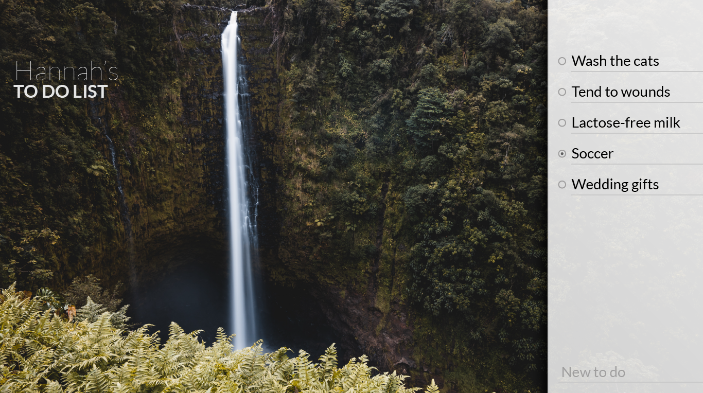
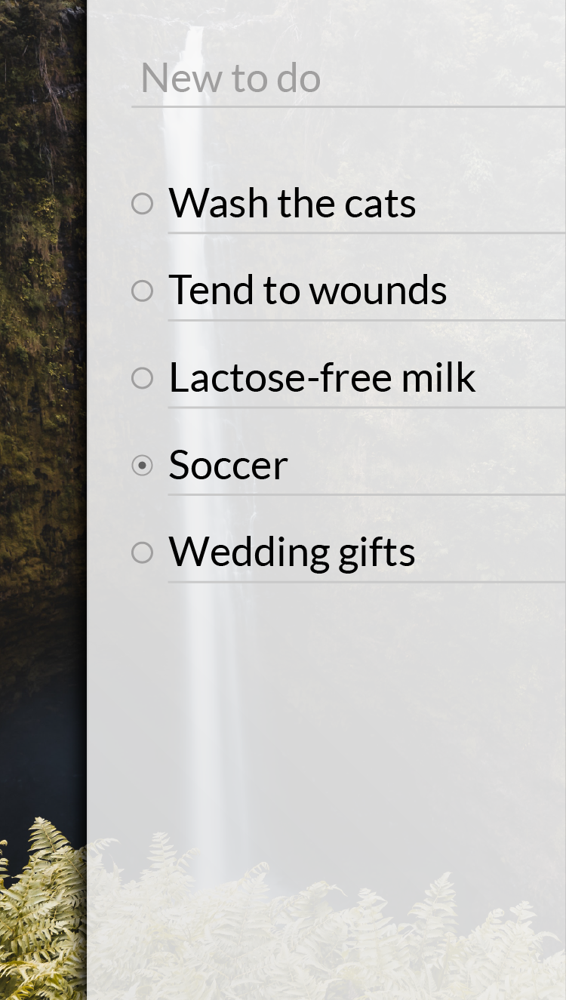

# ToDoList_MySQL

## Part 1: To Do List Application

For the main part of this week's homework, you're going to be creating a to do list application with MySQL and Sequelize as the ORM as the backend database.

Use this image as your UI guide.

Your application must be deployed to Heroku with MySQL. Submit a Github and Heroku link to BCS.

---

## Part 2: Blog Post

Make a blog post to DEV.to or Medium with at least 250 words plus code and/or pictures about a coding-related topic.

Submit a link to your blog post to BCS.

---

## Part 3: Make a PR

Make a PR to an open source project. If you have a hard time finding a project talk to the instructional staff.

Submit a link to the PR to BCS.

